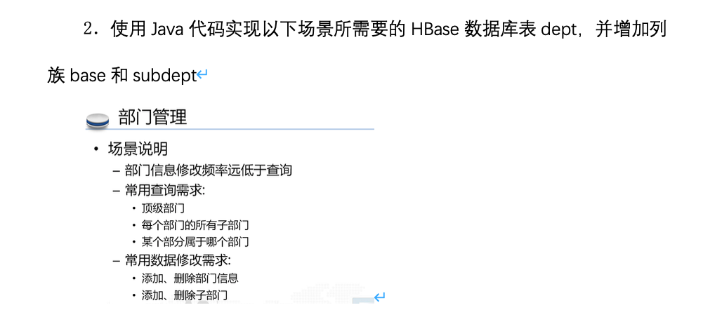
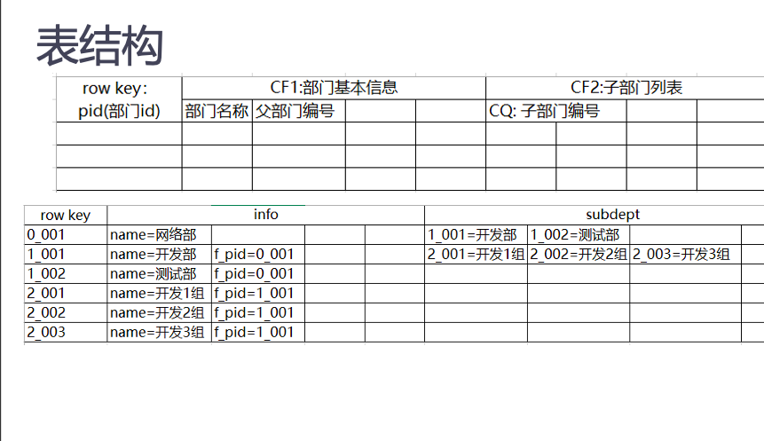

# hbase-javaapi-easy
## Hbase的Java Api
问题来自hbase课程实验，花了一下午时间写的使用java api连接hbase的功能,觉得还挺有意思。

问题背景是建一个树状结构的部门组织管理表。

在建表的时候使用了随机递归的方式生成一棵树。

### 主要实现了简单的

+ 封装了命名空间的增删

+ 封装了表的的简单增删改查

  #### 表的增删改查结合问题需求主要实现了如下要求(包含但不限于)

  + 查询所有一级部门(实际上可以查询任意级)
  + 已知rowKey，查询某一部门编号的基本信息
  + 已知rowKey，查询该部门的所有(直接)子部门信息
  + 已知rowKey，向该部门增加一个子部门
  + 已知rowKey（且该部门存在子部门），删除该部门信息，该部门所有(直接)子部门被调整到其他部门中

---

### 设计参考

